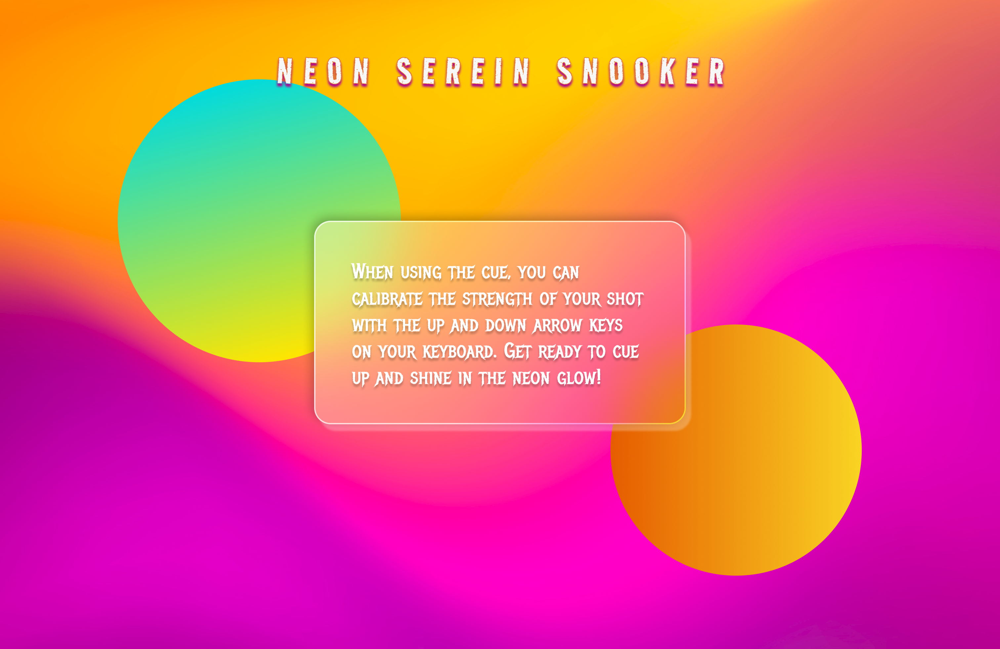

# Neon Serein Snooker

Neon Serein Snooker is a snooker game inspired by futuristic and revolutionary themes, characterized by its neon glassmorphism aesthetic and emphasis on user customization. It features multiple gameplay modes switchable via keys (1, 2, 3, 4) or corresponding buttons, along with diverse billiard table styles for user preference. The visual design of the table and its components (balls, cue, cushions, etc.) incorporates futuristic and realistic textures, achieved through advanced p5.js functionalities. Each component operates independently and modularly, with dedicated classes for the table, balls, and cue, ensuring efficient and organized functionality.

Player control of the cue leverages intuitive mouse and keyboard (UP/w, DOWN/s) inputs for precise strike force and positioning. Leveraging Matter.js, every component is equipped with a physical body for accurate collision detection and realistic physics simulation. The game enhances immersion with a variety of sound effects, complementing its visual appeal. Clear alerts and detailed instructions facilitate user understanding and gameplay comfort, particularly beneficial for newcomers to the game.

## Game Extension

### Aesthetics

I implemented a futuristic aesthetic allowing users to interact directly with buttons to switch between modes and change table styles.

### Functionality

I added a cue force bar for adjusting strike strength, real-time alerts for game status visibility, and realistic sounds for immersive gameplay. Pressing the "t" key toggles neon trails on the balls, adding a playful aesthetic touch.

### Game Type (Power Mode)

The fourth game type introduces a Power-boost mode, where the cueball can increase its speed by passing through designated neon boost spots on the table. Boost spots, represented by small neon marks (implemented using advanced p5.js drawing functions), enhance the cueball's speed for added excitement.

## Game Features

1. **Customizable Table Textures:** Choose from a selection of futuristic table textures to suit your visual preference.
2. **Multiple Game Modes:** Switch between different game modes, including Power Mode, Time Trial, and Classic, to experience diverse gameplay.
3. **Speed Boost Power-Up:** Activate the Speed Boost Power-Up to temporarily increase the speed of the cue ball.
4. **Realistic Physics Simulation:** Enjoy accurate physics simulation for a realistic gameplay experience.
5. **Neon Glassmorphism Aesthetic:** Experience a visually stunning neon glassmorphism design throughout the game.
6. **User-Friendly Controls:** Utilize intuitive mouse and keyboard controls for precise cue positioning and striking.
7. **Sound Effects:** Immerse yourself in the game with dynamic sound effects for collisions and interactions.
8. **Clear Alerts and Instructions:** Receive clear alerts and detailed instructions to enhance your understanding and enjoyment of the game.

## Video demonstration

Video demonstration: https://vimeo.com/980396665
